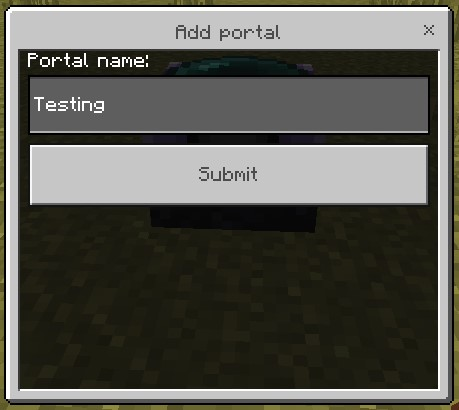
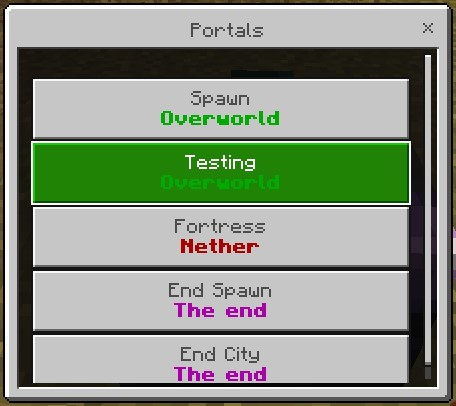
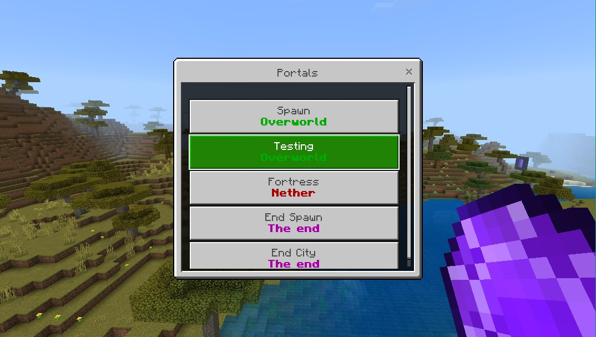
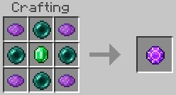
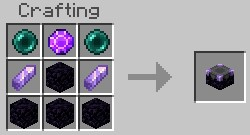

# Teleporter Addon

This addon acts like the waystone mod for java edition, but more simple. It's add a block and an item. This block let you save the location to access from this block, or others teleport blocks in world and dimensions. And the item gives you the possibilites of access the portals in a portable way.

## How it work

When the player interacts with the block for the first time, you actives it, and when you interact when the block is activated, an ui will appears. This ui let you give a name for this location, the name can't be empty and you can't give a name that already have been registered by other block in other location.

<p align="center">
  
</p>

<p align="center">
  
</p>

Interacting with a registered block or using the gem item, you access the list ui, this list shows all the portals you have registered in your world.

<p align="center">
  
</p>

<p align="center">
  
</p>

<p align="center">
  
</p>

And when you select a portal, your player will be teleported to a block above the location of the teleporter block.

<p align="center">
  
</p>

Using the item will start a 30 seconds cooldown for use it again.

<p align="center">
  
</p>

If you break a block that is already registered, you deletes its location from the list of portals.

<p align="center">
  
</p>

You can use the portals through dimensions

<p align="center">
  
</p>

## Crafting

Teleporter gem
<p align="center">
  
</p>

Teleporter block
<p align="center">
  
</p>

## Install all dependencies

```powershell
npm install
```

This commands will install all dependencies to your project, to all work properly.

## Convert to JavaScript and send to minecraft

```powershell
npm run local-deploy
```

This uses a build tool called just-scripts and automatically compiles your TypeScript project and pushes it over into Minecraft.
